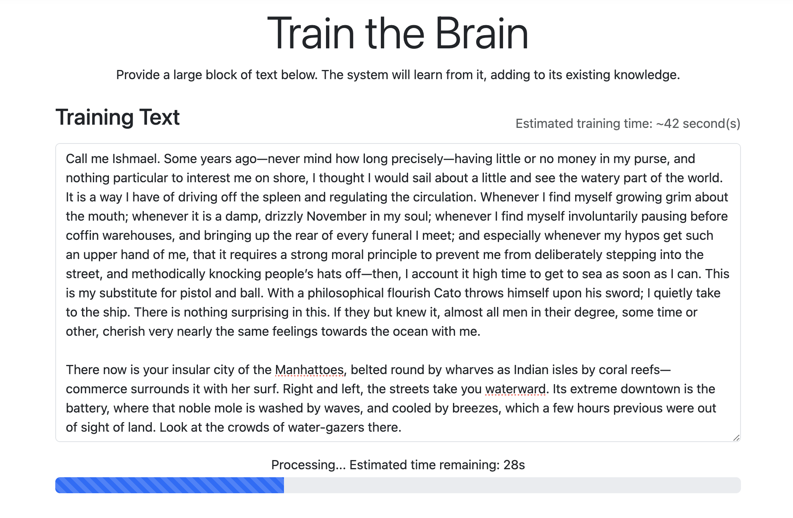

# Real-time, Database-Driven Markov Chain Text Generator

**This project is a technology demo that transforms the Markov Chain, a classic statistical text generation algorithm, into a modern and interactive web application.**

By learning from texts provided by the user, it can generate consistent and fluent new texts that mimic the style of a specific author or text. The project demonstrates how a simple concept can be scaled with database integration and real-time web technologies and turned into a user-friendly product.

|                                                                         **Training Interface (Train Page)**                                                                         |                                                     **Generation Interface (Generate Page)**                                                     |
| :-----------------------------------------------------------------------------------------------------------------------------------------------------------------------------: | :----------------------------------------------------------------------------------------------------------------------------------------: |
|                                                                                                                                         |                                                                                                 |
| _The model is trained by being fed large texts through this interface. The system offers an estimated time and a simulated progress bar to improve user experience._ | _The user enters a starting text and the model streams the rest of the sentence to the screen in real-time using SignalR._ |

## Conceptual Overview

This project is built upon three fundamental technological pillars:

### 1. Statistical Learning and Text Generation

At the heart of the project lies an **N-gram Markov Chain** model that learns the statistical probabilities of word sequences in text data. The system generates text by asking the question "which word is most likely to follow which sequence of words?". This allows the model to imitate a specific author's style, word choices, and sentence structures.

### 2. Scalable Memory and Persistence

The model's "memory" is stored in a **SQLite** database instead of a simple file. Managed via Entity Framework Core, this database allows the model to:

-   **Incremental Learning:** Each new training data is added on top of the existing knowledge accumulation.
-   **Large Data Sets:** Can efficiently store and query millions of N-grams.
-   **Persistence:** Learned information is not lost even if the application restarts.

### 3. Real-Time Interaction

**SignalR** technology is used to take the user experience beyond static web pages. When the text generation process starts, the page does not refresh. Instead, every generated word or phrase is immediately "streamed" from the server to the user's browser. This creates a dynamic and interactive experience by allowing the user to watch the system's "thinking" process live.

## Key Features

-   **Dynamic Text Generation:** Create new and original texts based on a starting text (seed phrase) provided by the user.
-   **Adjustable Length:** The word count of the text to be generated can be determined by the user.
-   **Smart Text Formatting:** The generated text is presented in a clean and readable format, complying with grammar rules like punctuation and quotation marks.
-   **Separate Training and Generation Interfaces:** Two distinct and user-friendly interfaces designed for feeding the model with new data and generating text from the model, respectively.

## Technology Architecture

-   **Backend:** ASP.NET Core MVC, SignalR, Entity Framework Core (.NET 8)
-   **Database:** SQLite
-   **Frontend:** Razor Pages, JavaScript, Bootstrap 5
-   **Core Algorithm:** N-gram based Markov Chain

## Installation and Execution Details

Follow the steps below to run this project on your local machine.

**Prerequisites:**

-   [.NET 8 SDK](https://dotnet.microsoft.com/download/dotnet/8.0) or higher
-   EF Core CLI tool (`dotnet tool install --global dotnet-ef`)

**Steps:**

1.  **Clone the Project:**
    ```bash
    git clone <this_project_github_url>
    cd MarkovWebApp
    ```
2.  **Install Dependencies:**
    ```bash
    dotnet restore
    ```
3.  **Create the Database:**
    ```bash
    dotnet ef database update
    ```
4.  **Run the Application:**
    ```bash
    dotnet run
    ```
    The application will start running by default at an address like `http://localhost:5xxx`.
